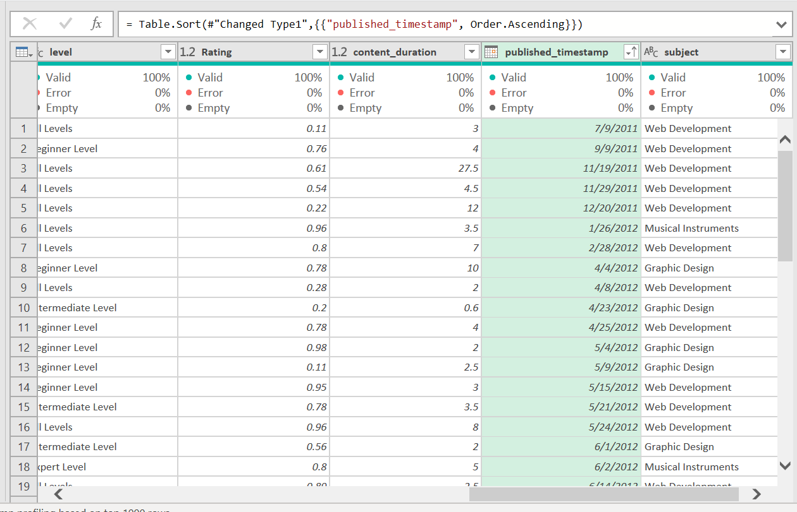
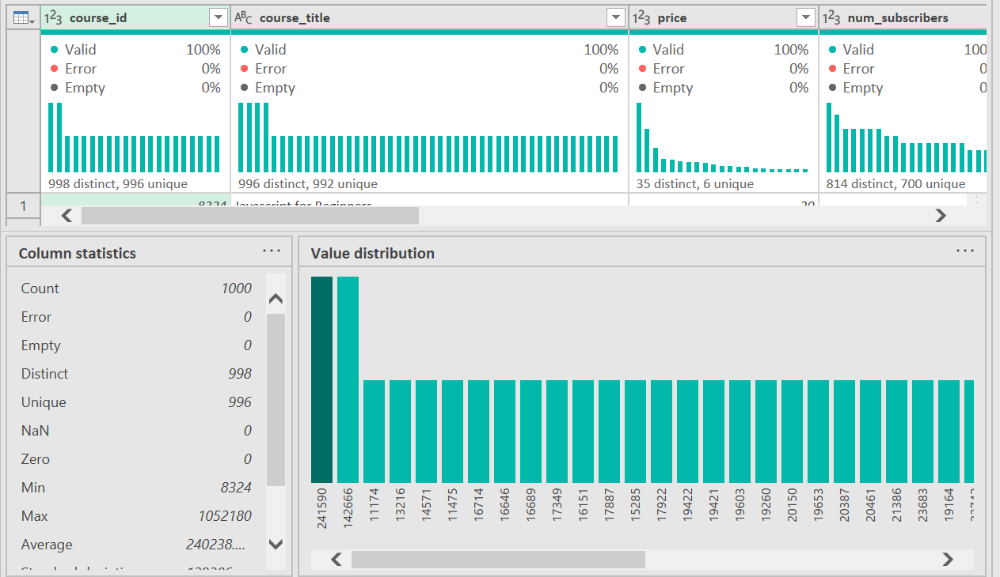

# Udemy-Analysis

I joined a 30 days data challenge, November 2022. The Udemy courses dataset was part of the dataset for practice, used excel for cleaning and pivot table for visualization.  I acquired power BI skill and visualized this dataset again on Power BI.

## Introduction

This dataset consists of courses Udemy offered 2011 up to the year 2017, it consists of four (4) courses data table (Graphic Design, Musical Instrument, Web Development and Business Finance). Across these four data tables, they all have 12 columns and the same column titles (course_id, course_title, Url, price, num_subcribers, num_reviews, num_lectures, level, rating, content_duration, published_timestamp and subject).

## Project Objective

- To know total subscribers over the years and what year had the highest subscribers.
- What course generate the highest profit from 2011 – 2017.
- What year had the highest profit and why.

## Data Tools Used 
Microsoft Power BI

## Data Cleaning

First process I did, was append the data tables to a single table, this is to make the cleaning process faster

This changed brought mixtures of courses in the subject column, unlike before where it had a specific course on separate data table. 

Thereafter, I observed the Url column which consists of the links that contains the course title. Having the course title in place, the Url is removed. 

The published_timestamp, has both date and time data type, changed it to only date. Then proceeded to make the date in ascending order, this is to have the older dates first before the recent dates. 

An Amazing part of using power query that save time, is the data profiling. The column quality, distribution and profile, these tools makes data cleaning easy and faster, giving columns summary.

The column profile for course_id, indicates 2 Id’s with duplicate values all through the other columns,checked for it, and sorted them. They had the same values all through the other columns, having a diffrence of a letter, causing a mispelling in the course title column and this resulted to duplicates. This is removed thus making the data clean with no duplicates. 

Changed the price data type to currency.

Changed the Letter case of course_id, course_title, level, and subject columns, from a Lower case to upper case. Renamed the column num_subcribers to Total_subcribers, num_reviews to Total_reviews, num_lectures to Total_lectures, content_duration to Course_duration, published_timestamp to Date, and price to Course_fee,while the Rating column maintains its upper case. 

Further Checked for missing or null values and there are no null /missing values.

